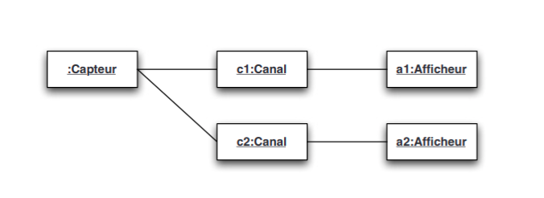

# AOC
<h2> Nicolas Demongeot Paul Borie Jean Derieux</h2>
<h2>Compte Rendu </h2>

<h4>Introduction</h4>

Ce projet a pour but de manier différents design pattern tel que "Active Object", "Strategy" et "Proxy".
Le projet vise a simuler une communication entre un capteur et des afficheurs via des "canaux" faisant le lien entre ces deux entités.
Ces canaux servent a créer un délai entre les communications.

<h1>Conception</h1>

<h5>Architecture du projet : </h3>

<h5>Architecture avec introduction des rôles des différents design pattern : </h5>

 

<h3>Pattern Strategy</h3>

La diffusion des messages est prévu pour s'effectuer de différentes manières selon la stratégie choisit au moment de l'instanciation de cette dernière. Il y a 3 modes possible, la diffusion Atomique, Sequentielle ou encore par époque. 

<h1>Résultats</h1>

<h3> Diffusion Atomique : </h3>

Avec la diffusion atomique les Afficheurs reçoivent toutes les valeurs émise par le capteur, on se situe dans un probleme classique de "lecteur/redacteur" ou le capteur joue le role du writer et les afficheur celui des readers. Pour que ce soit possible il est nécessaire de paralyser le thread sur lequel s'éxecute le capteur afin de bloquer son exécution et ainsi qu'il n'auto-incrémente plus sa valeur a émettre tant que tout les afficheurs n'ont pas lus cette valeur.

Implémentation : pour bloquer ce fameux thread on va dans la dîte stratégie, faire "l'appel", on va créer un sémaphore avec autant de "permits" qu'il y a d'afficheur à notifier. Lors d'une émission de valeur par le capteur on va acquire cardinal(afficheur) permits , c-à-d l'ensemble des permits du semaphore.

Lorsqu'un afficheur obtient la valeur du capteur il relache un "permits", Lorsque l'ensemble des afficheur on reçu la valeur l'execution peut se poursuivre  le acquire(card(afficheur)) est débloqué.

<h3>Tests Junit :</h3>

Pour vérifier la véracité de nos résultats on procède a 3 test, on vérifie bien que tout valeurs reçu par les afficheurs  sont égales et rangés dans le même ordre via le test " test égalité", on vérifie ensuite que les listes des valeurs soit bien trié en ordre croissant strict avec le test homonyme ce qui induit que toute les valeurs sont différentes (la liste [4,4,5] retourne false), dernier test on vérifie que le nombre de valeur reçu correspond au nombre d'émission avec le test "toute les valeur lus". Passer ces trois test permet d'être sur que les conditions soient respecter pour valider la cohérence atomique.

<h3>Diffusion par époque </h3>

Avec cette stratégie ce qu'on veut obtenir c'est que les afficheurs ne reçoivent pas de valeur antérieur a celles déjà reçu, c-à-d plus petites.

Ici pas besoin de faire de gestion avec les threads tout est asynchrone, la gestion de cette propriété est effectué directement dans l'afficheur qui n'acceptera de valeur entrante que ci cette derniere est supérieur strictement à sa valeur maximum.

<h3> Tests Junit : </h3>

Ici un seul test suffit on vérifié simplement que les valeurs sont rangé par ordre croissante ce qui induit que la reception par époque s'est bien déroulé.

<h3> Diffusion Sequentielle</h3>

La diffusion séquenciel, les afficheurs reçoivent le même sous-ensemble de valeurs du capteur.

Implémentation : lors de l'incrémentation du capteur, la stratégie va essayer d'obtenir tout les "permits" du sémaphore cette methode n'est pas bloquante si tout les afficheurs ne sont pas actuellement en attente d'une nouvelle valeur alors la transmission ne se fait pas et le capteur incrémente, sinon la transmission se fait les afficheur sont notifiés du changement de valeur.

<h3>Test Junit</h3>

Pour vérifier que la stratégie se déroule correctement, on va avoir besoin de deux test, un qui vérifie que les valeurs reçu par l'afficheur sont égales et rangé dans le même ordre et un deuxieme qui vérifiera que les valeurs reçu le sont respectant un ordre croissant strict.

